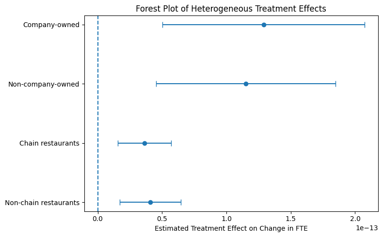

# Card & Krueger (1994) DID Replication

## Executive Memo

---

### Bottom Line Up Front (BLUF)

The New Jersey minimum wage increase did **not reduce employment** in fast-food restaurants compared to Pennsylvania.  
However, my extension shows that the impact of the policy was **not identical across all restaurants**, with differences between chain and non-chain establishments.

---

### The Mechanism (How This Works)

In the real world, we cannot randomly assign different minimum wages to restaurants. However, this study takes advantage of a real policy change: New Jersey raised its minimum wage, while nearby Pennsylvania did not.

This creates a natural comparison. Think of it like observing two similar groups over time—one affected by the policy and one not. By comparing how employment changed in both places before and after the policy, we can isolate the effect of the minimum wage increase from other broader economic trends.

---

### Visual Evidence

Below is the key result from the extension, showing how the employment impact differs across restaurant types.



**Figure: Heterogeneous Treatment Effects by Restaurant Type**  
The chart compares estimated employment effects across different groups of restaurants, with confidence intervals.  
The results suggest that the policy impact varies across subgroups rather than being exactly the same for all establishments.

---

### Business / Policy Implications

The findings suggest that minimum wage increases do not necessarily lead to job losses on average in this setting. However, the extension shows that different types of businesses may respond differently.

For policymakers, this means labor policies should consider differences across firms rather than assuming a single uniform effect.  
For business stakeholders, the results suggest that organizational structure—such as being part of a chain—may influence how firms adjust to increases in labor costs.

---

## Track A: The Causal Policy Track (Difference-in-Differences)

This project replicates Card & Krueger (1994), *Minimum Wages and Employment: A Case Study of the Fast-Food Industry in New Jersey and Pennsylvania*, which studies the impact of a minimum wage increase in New Jersey on fast-food employment relative to Pennsylvania.

The paper investigates whether an increase in the minimum wage in New Jersey reduced employment in fast-food restaurants relative to neighboring Pennsylvania. Using a Difference-in-Differences research design, the study estimates the causal effect of the policy change under the parallel trends assumption.

---

## Extension Overview

In addition to replicating the original study, this project extends the analysis by examining **heterogeneous treatment effects**.

Specifically, I test whether the employment impact of the minimum wage increase differs across restaurant types by interacting treatment status with:
- Chain status (chain vs non-chain restaurants)
- Ownership structure (company-owned vs non-company-owned)

This extension provides a more detailed understanding of how different types of firms respond to policy changes.

---

## Repository Structure
```
├── README.md
├── data/
│   ├── raw/
│   └── processed/
├── notebooks/
│   ├── 01_Data_Cleaning.ipynb
│   ├── 02_Replication_Analysis.ipynb
│   └── 03_Extension_and_Results.ipynb
└── requirements.txt
```

---

## Data Source

Replication dataset provided by David Card (UC Berkeley):  
https://davidcard.berkeley.edu/data_sets.html
